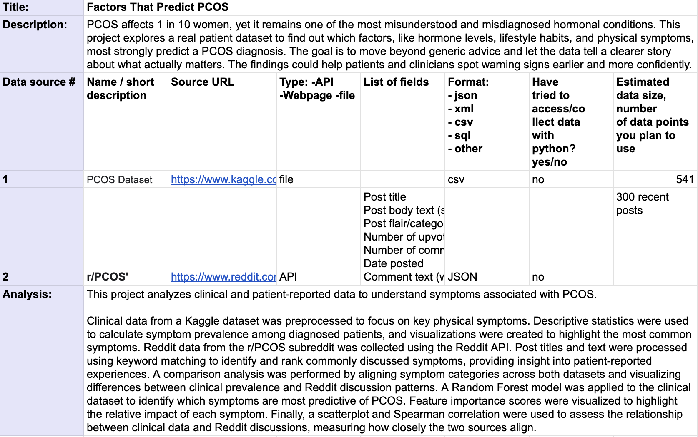

DSCI 510 – Spring 2026 – University of Southern California
Instructor: Dr. Alexey Tregubov

# Research on PCOS: Using Clinical Data and Reddit Analysis
This project explores factors that may predict Polycystic Ovary Syndrome (PCOS) using clinical and public data sources. This project compares clinical PCOS data with real-world patient discussions from Reddit to implement data analysis and machine learning.

## Data sources
1. Kaggle PCOS dataset (CSV)
2. Reddit API - r/PCOS subreddit
 

## Results
- Identified most common symptoms among PCOS patients (clinical data)
- Extracted and ranked symptoms discussed on Reddit
- Compared clinical prevalence vs patient discussion
- Found differences between what is clinically important vs commonly discussed
- Used Random Forest to identify most predictive symptoms for PCOS
- Measured alignment between sources using scatterplot and correlation

## Installation
- No API keys are required to run this project.
- Install required Python packages using:

pip install -r requirements.txt

Required libraries include:
- pandas
- matplotlib
- scikit-learn
- requests
- scipy
- python-dotenv

## Running analysis

From `src/` directory run:

`python src/main`

Results will appear in `results/` folder. All obtained data will be stored in `data/`.

The primary project workflow is run through `main.py`. The notebook is included only as an optional interactive visualization layer that calls existing functions from the `src/` modules. Individual modules can also be run from the src/ directory if needed, but main.py is the primary entry point.

I also created a `.env` file based on `.env.example`.

Example:
PCOS_DATA_PATH=data/PCOS_data.csv

## Notes
An additional external data source was identified for future integration to further expand analysis of PCOS risk factors and validation across datasets. Link: https://www.kaggle.com/datasets/hasaanrana/diet-exercise-and-pcos-insights 

## AI generated:
ChatGPT (OpenAI) was used as a coding assistant to help structure, debug, and refine portions of this project, including API handling, data processing, visualization, and model implementation. 

All generated outputs were reviewed, modified, and integrated by the author, who ensured complete understanding of the final code.